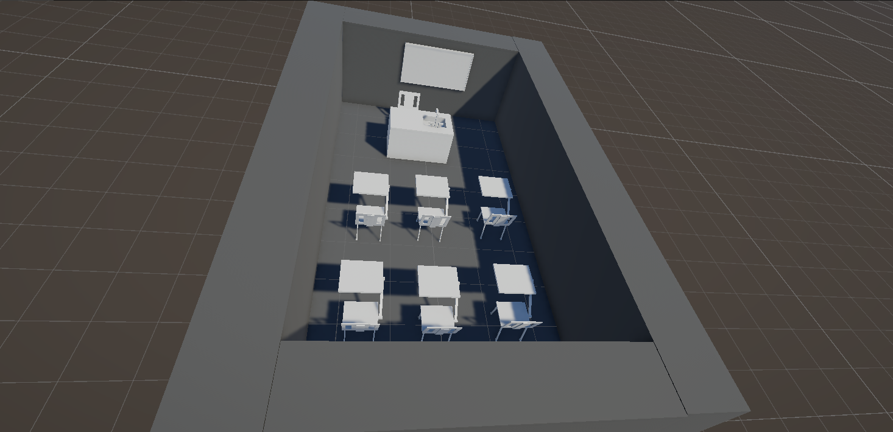

## Project Overview 🎥

Here's an overview of the classroom scene created with Unity:

## Project Documentation 📚

### General Description

This Unity project is an interactive classroom simulation, designed as a digital twin of an educational environment. The project aims to faithfully reproduce the atmosphere and functioning of a traditional classroom in a virtual environment.

### Main Features

- **Environment Simulation**: Detailed reproduction of a classroom with furniture and equipment
- **Navigation System**: Implementation of a student movement system using NavMesh
- **Interactivity**: Ability to move students between different points of interest

### Technical Structure

#### Main Scripts

1. **NavMeshWaypointPatrol** (`move-student1.cs`)

   - Manages automatic student movement
   - Uses Unity's NavMesh system for navigation
   - Allows defining waypoints for movement

2. **Student Movement System** (`move_student2.cs`)
   - Complementary script for student movement control

#### Assets Organization

- **Scenes/**: Contains the main `ClassroomScene`
- **SharedAssets/**: Assets shared between different scenes
- **Settings/**: Project configuration
- **Tutorials/**: Learning resources
- **school/**: School environment specific assets

### Tools and Technologies Used

- **Unity Engine**: Recent version with URP (Universal Render Pipeline)
- **NavMesh**: For agent navigation
- **Visual Studio Code**: For script development
- **Git**: For version control

### Installation and Setup

1. Clone the repository
2. Open the project in Unity
3. Open the `ClassroomScene` in the `Assets/Scenes` folder
4. Configure waypoints for students if needed
